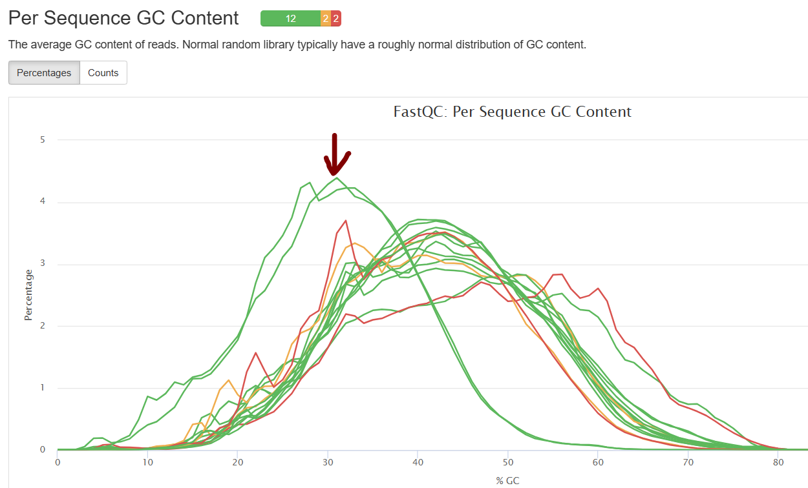
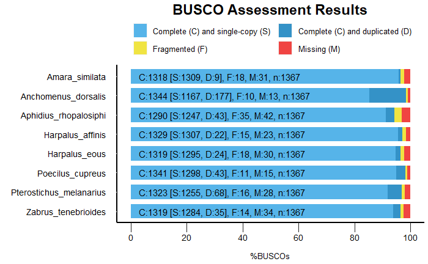

```{r setup, include=FALSE}
knitr::opts_chunk$set(echo = TRUE)
```


# Objective

Di Ju and Katharina Ziese-Kubon proceeded to the RNA extraction and mRNA-seq library preparation of 8 different insect species. The libraries were sequenced in 100+100 PE mode by BGI.

Transcriptome assemblies of eight non-target insect species present in autumn rapeseed fields (post-harvest).

The data are available on the BioProject PRJNA1218941 on NCBI (https://www.ncbi.nlm.nih.gov/).

# Insect species

Insects collected or purchased and identified by Di Ju and Bernd Ulber:

| library | species                   | NCBI taxonomy ID | Source                                   |
|---------|---------------------------|------------------|------------------------------------------|
| 01_Ad   | Anchomenus dorsalis       | 586010           | Rapeseed   field Goettingen (Germany)    |
| 02_Pm   | Pterostichus   melanarius | 60768            | Rapeseed field Goettingen (Germany)      |
| 03_Zt   | Zabrus tenebrioides       | 272042           | Rapeseed   field Goettingen (Germany)    |
| 04_Asp  | Amara similata            | 272013           | Rapeseed field Goettingen (Germany)      |
| 05_G    | Harpalus affinis          | 247283           | Rapeseed   field Goettingen (Germany)    |
| 06_Ol   | Harpalus eous             | 2107211          | Rapeseed field Goettingen (Germany)      |
| 07_Pr   | Poecilus cupreus          | 270614           | Katz   Biotech AG (Germany)              |
| 08_Ar   | Aphidius   rhopalosiphi   | 55891            | Bio-Test Labor GmbH Sagerheide (Germany) |

+ morphology and species attributes: https://www.gbif.org/species/search?q=
+ Full taxonomy: https://www.ncbi.nlm.nih.gov/Taxonomy/Browser/wwwtax.cgi

Besides Aphidius rhopalosiphi (parasitic wasp, Hymenoptera), all other 7 species are Coleoptera.

Two specimens (_Anchomenus dorsalis_ and _Harpalus affinis_) could not be identified with certainty at the species levels and were therefore genotyped. We used the mitochondrial gene cytochrome _c_ oxidase I (COI), commonly used as a DNA barcode for insect taxonomy. DNA was extracted (kit) and amplified by PCR using the primer LCO1490 (GGTCAACAAATCATAAAGATATTGG) and HCO2198 (TAAACTTCAGGGTGACCAAAAAATCA) ([Hebert et al. 2003](https://royalsocietypublishing.org/doi/10.1098/rspb.2002.2218)). The PCR products were purified (kit) and sent for Sanger sequencing. Sequences were compared with annotated COI sequences from NCBI (see below) using Omega Clustal alignment tool (https://www.ebi.ac.uk/jdispatcher/msa/clustalo?stype=dna). Complete match between the sequences confirmed the identity of the two specimens.

Reference cytochrome _c_ oxidase I (COI) sequences used for comparison:

- _Anchomenus dorsalis_ (NCBI taxonomy ID 586010) https://www.ncbi.nlm.nih.gov/nuccore/HQ953549.1
- _Harpalus affinis_ (NCBI taxonomy ID 247283) https://www.ncbi.nlm.nih.gov/nuccore/OK638137.1

# Data

Data are in `/usr/users/npghpc/data/NGS_data/BGI_data/F22FTSEUHT1495_LIBgsmfR_judi_8_insects`

Summary statistics for raw data:

| Sample | Length(bp) | TotalReads            |
|--------|------------|-----------------------|
| 01_Ad  | 100;100    |           64,769,548  |
| 02_Pm  | 100;100    |           56,305,457  |
| 03_Zt  | 100;100    |           50,054,875  |
| 04_Asp | 100;100    |           42,581,758  |
| 05_G   | 100;100    |           41,668,796  |
| 06_Ol  | 100;100    |           57,482,693  |
| 07_Pr  | 100;100    |           47,960,411  |
| 08_Ar  | 100;100    |           44,601,099  |

We have between 44 and 64 M paired-end reads.

## Fastqc

```{bash, eval=FALSE}

module load fastqc/0.12.1

f *fq.gz > list_fastq.txt

while read i; do 
   srun --partition medium fastqc $i -o fastqc_reports/ & 
done < list_fastq.txt

```




_Aphidius rhopalosiphi_ (08_Ar, red arrow) shows a very low GC content (30%) compared to all other Coleopteran species (40%). This was reported (https://pmc.ncbi.nlm.nih.gov/articles/PMC5993429/):

> Among sequenced examples, hymenopteran genomes are moderate in size (80% are between 180–340Mb) with a few exceptions [10–12]. Most possess 12,000–20,000 genes (note counts are highly annotation-pipeline and assembly contiguity dependent[13]), with a relatively low content of repetitive and transposable elements. One unusual feature is low GC content, which ranges from 30–45% depending on the species[8]. Although the reason for low GC content is not yet understood, it may be related to GC-biased gene conversion and high recombination rates[14]. Due to their relatively small size and simple structure, Hymenopteran genomes are readily assembled and highly tractable for genome sequencing[15].

The adapter content profile was also different for _Aphidius rhopalosiphi_ with the presence of the polyA (AAAAAAAAAAAA) (see in `fastqc/lib/Configuration/adapter_list.txt`). Signal perhaps related to the low GC content?

# Trimming

Note that Trinity will skip reads of less than 25 bp so set the minimum size to 25 nt. Remove 3' adapters from read 1 and read 2 and trim by quality, allowing no Ns.

## 01_trimming_cutadapt.sh

```{bash, eval=FALSE}

#!/bin/bash
#
#SBATCH --job-name=trimming_cutadapt
#SBATCH --nodes=1
#SBATCH --ntasks=1 
#SBATCH --mem=16000
#SBATCH --partition=medium
#SBATCH --time=02:00:00
#SBATCH --constraint=scratch
#SBATCH --mail-type=END
#SBATCH --mail-user=johan.zicola@uni-goettingen.de
#SBATCH --output=slurm/job.%x.%A.%a.out
#SBATCH --error=slurm/job.%x.%A.%a.err
#SBATCH --array=1-8

echo "Starting at $(date)"
echo "Cluster: $SLURM_CLUSTER_NAME"
echo "Job name: $SLURM_JOB_NAME"
echo "Number of CPUs: $SLURM_CPUS_ON_NODE"
echo "RAM: $(($SLURM_MEM_PER_NODE/1024))GB"

module load cutadapt/4.4

file_name=$(find . -type f -name "*fq.gz" | \
cut -d_ -f1-4 | sort | uniq | sed -n ${SLURM_ARRAY_TASK_ID}p)

cutadapt -a AGATCGGAAGAGCACACGTCTGAACTCCAGTCA \
    -A AGATCGGAAGAGCGTCGTGTAGGGAAAGAGTGT \
    --quality-base 33 --max-n 0 --minimum-length 25 -o ${file_name}_1.trimmed.fq \
    -p ${file_name}_2.trimmed.fq ${file_name}_1.fq ${file_name}_2.fq
    
```

Number of reads after trimming:

```{bash, eval=FALSE}
for i in *fq; do srun --partition medium fastqc $i -o fastqc_output/ & done

cut -f1,6 multiqc_general_stats.txt
```


| Sample      | TotalReads  |
|-------------|-------------|
| 01_Ad_L1_1  | 63,577,928  |
| 01_Ad_L1_2  | 63,577,928  |
| 02_Pm_L1_1  | 55,269,387  |
| 02_Pm_L1_2  | 55,269,387  |
| 03_Zt_L1_1  | 49,128,635  |
| 03_Zt_L1_2  | 49,128,635  |
| 04_Asp_L1_1 | 41,800,974  |
| 04_Asp_L1_2 | 41,800,974  |
| 05_G_L1_1   | 40,906,340  |
| 05_G_L1_2   | 40,906,340  |
| 06_Ol_L1_1  | 56,417,880  |
| 06_Ol_L1_2  | 56,417,880  |
| 07_Pr_L1_1  | 47,070,196  |
| 07_Pr_L1_2  | 47,070,196  |
| 08_Ar_L1_1  | 43,759,260  |
| 08_Ar_L1_2  | 43,759,260  |


# Remove rRNA-mapping reads

```{bash, eval=FALSE}
module load rev/23.12 miniconda3/22.11.1

conda create -n ribodetector python=3.8
conda activate ribodetector

# conda install -c bioconda ribodetector
# Doesn't work

pip install ribodetector
# Worked

ribodetector --version
ribodetector 0.3.1

# Doc recommends 20 Gb of RAM for PE data and 20 threads
```

Based on ribodetector manual (https://github.com/hzi-bifo/RiboDetector):
> chunk_size * 1024 reads to load each time. When chunk_size=1000 and threads=20, consuming ~20G memory, better to be multiples of the number of threads.


## 02_rRNA_removal.sh

```{bash, eval=FALSE}
#!/bin/bash
#SBATCH --job-name=ribodetector
#SBATCH --nodes=1
#SBATCH --partition=medium
#SBATCH --time=04:00:00
#SBATCH --cpus-per-task=20
#SBATCH --threads-per-core=1
#SBATCH --mem=30gb
#SBATCH --mail-type=END
#SBATCH --mail-user=johan.zicola@uni-goettingen.de
#SBATCH --output=slurm/job.%x.%j.out
#SBATCH --error=slurm/job.%x.%j.err

echo "Starting at $(date)"
echo "Cluster: $SLURM_CLUSTER_NAME"
echo "Job name: $SLURM_JOB_NAME"
echo "Number of CPUs: $SLURM_CPUS_ON_NODE"
echo "RAM: $(($SLURM_MEM_PER_NODE/1024))GB"

module purge

module load anaconda3/2021.05

source activate ribodetector

ribodetector_cpu -t 20 \
  -l 100 \
  -i $INPUT_FASTQ_LEFT $INPUT_FASTQ_RIGHT \
  -e rrna \
  --chunk_size 1000 \
  -o $OUTPUT_FASTQ_LEFT $OUTPUT_FASTQ_RIGHT

```

```{bash, eval=FALSE}

while read i; do
   sbatch --export=INPUT_FASTQ_LEFT=trimmed_reads/${i}_L1_1.trimmed.fq,INPUT_FASTQ_RIGHT=trimmed_reads/${i}_L1_2.trimmed.fq,OUTPUT_FASTQ_LEFT=trimmed_reads/rrna_removed/${i}_L1_1.trimmed.mRNA.fq,OUTPUT_FASTQ_RIGHT=trimmed_reads/rrna_removed/${i}_L1_2.trimmed.mRNA.fq 02_rRNA_removal.sh
done < trimmed_reads/list.txt

```


| Sample      | raw        | after_trimming | after_rRNA_removal | % rRNA |
|-------------|------------|----------------|--------------------|--------|
| 01_Ad_L1_1  | 64,769,548 | 63,577,584     | 62,903,350         | 1.06%  |
| 01_Ad_L1_2  | 64,769,548 | 63,577,584     | 62,903,350         | 1.06%  |
| 02_Pm_L1_1  | 56,305,457 | 55,268,700     | 54,872,720         | 0.72%  |
| 02_Pm_L1_2  | 56,305,457 | 55,268,700     | 54,872,720         | 0.72%  |
| 03_Zt_L1_1  | 50,054,875 | 49,128,370     | 48,909,030         | 0.45%  |
| 03_Zt_L1_2  | 50,054,875 | 49,128,370     | 48,909,030         | 0.45%  |
| 04_Asp_L1_1 | 42,581,758 | 41,800,517     | 41,629,666         | 0.41%  |
| 04_Asp_L1_2 | 42,581,758 | 41,800,517     | 41,629,666         | 0.41%  |
| 05_G_L1_1   | 41,668,796 | 40,905,979     | 40,609,402         | 0.73%  |
| 05_G_L1_2   | 41,668,796 | 40,905,979     | 40,609,402         | 0.73%  |
| 06_Ol_L1_1  | 57,482,693 | 56,417,515     | 56,041,881         | 0.67%  |
| 06_Ol_L1_2  | 57,482,693 | 56,417,515     | 56,041,881         | 0.67%  |
| 07_Pr_L1_1  | 47,960,411 | 47,069,928     | 46,852,466         | 0.46%  |
| 07_Pr_L1_2  | 47,960,411 | 47,069,928     | 46,852,466         | 0.46%  |
| 08_Ar_L1_1  | 44,601,099 | 43,758,919     | 43,367,052         | 0.90%  |
| 08_Ar_L1_2  | 44,601,099 | 43,758,919     | 43,367,052         | 0.90%  |

Less than 1% of reads match rRNAs apart from 01_Ad (1%).


# Trinity 

Use apptainer, the easiest solution to deal with all Trinity dependencies.

Download container file of version v2.15.1 on https://github.com/trinityrnaseq/trinityrnaseq/releases.

## 03_trinity.sh

```{bash, eval=FALSE}
#!/bin/bash
#SBATCH --job-name=Trinity
#SBATCH --nodes=1
#SBATCH --time=20:00:00
#SBATCH --cpus-per-task=8
#SBATCH --mem=110gb
#SBATCH --partition=medium
#SBATCH --mail-type=END
#SBATCH --mail-user=johan.zicola@uni-goettingen.de
#SBATCH --output=slurm/job.%x.%j.out
#SBATCH --error=slurm/job.%x.%j.err

echo "Starting at $(date)"
echo "Cluster: $SLURM_CLUSTER_NAME"
echo "Job name: $SLURM_JOB_NAME"
echo "Number of CPUs: $SLURM_CPUS_ON_NODE"
echo "RAM: $(($SLURM_MEM_PER_NODE/1024))GB"

module purge

module load apptainer

PATH_DIR="/scratch/users/zicola/F22FTSEUHT1495_LIBgsmfR_judi_8_insects"

apptainer exec --bind $PATH_DIR -e /usr/users/zicola/bin/trinityrnaseq.v2.15.1.simg  Trinity \
          --max_memory 100G \
          --CPU $SLURM_CPUS_PER_TASK \
          --seqType fq \
          --SS_lib_type RF \
          --left ${PATH_DIR}/$INPUT_FASTQ_LEFT  \
          --right ${PATH_DIR}/$INPUT_FASTQ_RIGHT \
          --output ${PATH_DIR}/$OUTPUT_DIR

```

Loop of over each sample:

```{bash, eval=FALSE}

while read i; do
  sbatch  --export=INPUT_FASTQ_LEFT=trimmed_reads/rrna_removed/${i}_L1_1.trimmed.mRNA.fq,INPUT_FASTQ_RIGHT=trimmed_reads/rrna_removed/${i}_L1_2.trimmed.mRNA.fq,OUTPUT_DIR=trinity_output/${i}/${i}_trinity 03_trinity.sh
done < trimmed_reads/list.txt

```


# Quality check TrinityStats

```{bash, eval=FALSE}

path_output="/scratch/users/zicola/F22FTSEUHT1495_LIBgsmfR_judi_8_insects/trinity_output"

module load apptainer

while read i; do
   echo $i
   apptainer exec --bind $path_output \
   -e /usr/users/zicola/bin/trinityrnaseq.v2.15.1.simg \
   /usr/local/bin/util/TrinityStats.pl ${path_output}/${i}/${i}_trinity.Trinity.fasta
done < list_libraries.txt


```

## Amara_similata

```
################################
## Counts of transcripts, etc.
################################
Total trinity 'genes':  45378
Total trinity transcripts:      72529
Percent GC: 37.03

########################################
Stats based on ALL transcript contigs:
########################################

        Contig N10: 6269
        Contig N20: 4545
        Contig N30: 3577
        Contig N40: 2819
        Contig N50: 2233

        Median contig length: 533
        Average contig: 1141.92
        Total assembled bases: 82822303


#####################################################
## Stats based on ONLY LONGEST ISOFORM per 'GENE':
#####################################################

        Contig N10: 5565
        Contig N20: 3941
        Contig N30: 2971
        Contig N40: 2280
        Contig N50: 1752

        Median contig length: 388
        Average contig: 862.32
        Total assembled bases: 39130495


```

## Anchomenus_dorsalis

```
################################
## Counts of transcripts, etc.
################################
Total trinity 'genes':  66955
Total trinity transcripts:      102969
Percent GC: 36.51

########################################
Stats based on ALL transcript contigs:
########################################

        Contig N10: 6380
        Contig N20: 4629
        Contig N30: 3600
        Contig N40: 2838
        Contig N50: 2227

        Median contig length: 461
        Average contig: 1073.07
        Total assembled bases: 110492695


#####################################################
## Stats based on ONLY LONGEST ISOFORM per 'GENE':
#####################################################

        Contig N10: 5492
        Contig N20: 3840
        Contig N30: 2823
        Contig N40: 2094
        Contig N50: 1507

        Median contig length: 348
        Average contig: 752.03
        Total assembled bases: 50352161


```


## Aphidius_rhopalosiphi

```
################################
## Counts of transcripts, etc.
################################
Total trinity 'genes': 202451
Total trinity transcripts: 249345
Percent GC: 27.08

########################################
Stats based on ALL transcript contigs:
########################################

        Contig N10: 3212
        Contig N20: 2154
        Contig N30: 1502
        Contig N40: 986
        Contig N50: 681

        Median contig length: 350
        Average contig: 564.02
        Total assembled bases: 140636468


#####################################################
## Stats based on ONLY LONGEST ISOFORM per 'GENE':
#####################################################

        Contig N10: 2433
        Contig N20: 1443
        Contig N30: 899
        Contig N40: 646
        Contig N50: 508

        Median contig length: 334
        Average contig: 478.90
        Total assembled bases: 96953299


```

## Harpalus_affinis

```
################################
## Counts of transcripts, etc.
################################
Total trinity 'genes':  62888
Total trinity transcripts:      104141
Percent GC: 36.59

########################################
Stats based on ALL transcript contigs:
########################################

        Contig N10: 5666
        Contig N20: 3982
        Contig N30: 3015
        Contig N40: 2376
        Contig N50: 1853

        Median contig length: 455
        Average contig: 966.33
        Total assembled bases: 100634161


#####################################################
## Stats based on ONLY LONGEST ISOFORM per 'GENE':
#####################################################

        Contig N10: 4889
        Contig N20: 3314
        Contig N30: 2442
        Contig N40: 1835
        Contig N50: 1360

        Median contig length: 352
        Average contig: 729.35
        Total assembled bases: 45867434


```

## Harpalus_eous

```
################################
## Counts of transcripts, etc.
################################
Total trinity 'genes':  64108
Total trinity transcripts:      100318
Percent GC: 35.67

########################################
Stats based on ALL transcript contigs:
########################################

        Contig N10: 5361
        Contig N20: 3943
        Contig N30: 3030
        Contig N40: 2379
        Contig N50: 1862

        Median contig length: 447
        Average contig: 959.71
        Total assembled bases: 96276103


#####################################################
## Stats based on ONLY LONGEST ISOFORM per 'GENE':
#####################################################

        Contig N10: 4791
        Contig N20: 3351
        Contig N30: 2475
        Contig N40: 1871
        Contig N50: 1376

        Median contig length: 357
        Average contig: 732.86
        Total assembled bases: 46982078


```


## Poecilus_cupreus

```
################################
## Counts of transcripts, etc.
################################
Total trinity 'genes':  56762
Total trinity transcripts:      92510
Percent GC: 37.40

########################################
Stats based on ALL transcript contigs:
########################################

        Contig N10: 6472
        Contig N20: 4702
        Contig N30: 3753
        Contig N40: 2957
        Contig N50: 2332

        Median contig length: 537
        Average contig: 1170.43
        Total assembled bases: 108276782


#####################################################
## Stats based on ONLY LONGEST ISOFORM per 'GENE':
#####################################################

        Contig N10: 5745
        Contig N20: 4124
        Contig N30: 3014
        Contig N40: 2282
        Contig N50: 1698

        Median contig length: 375
        Average contig: 830.22
        Total assembled bases: 47124764

```

## Pterostichus_melanarius


```
################################
## Counts of transcripts, etc.
################################
Total trinity 'genes': 94211
Total trinity transcripts: 140181
Percent GC: 36.70

########################################
Stats based on ALL transcript contigs:
########################################

        Contig N10: 5443
        Contig N20: 3948
        Contig N30: 2945
        Contig N40: 2242
        Contig N50: 1693

        Median contig length: 373
        Average contig: 830.65
        Total assembled bases: 116440725


#####################################################
## Stats based on ONLY LONGEST ISOFORM per 'GENE':
#####################################################

        Contig N10: 4734
        Contig N20: 3162
        Contig N30: 2224
        Contig N40: 1590
        Contig N50: 1028

        Median contig length: 317
        Average contig: 620.64
        Total assembled bases: 58470956


```

## Zabrus_tenebrioides

```
################################
## Counts of transcripts, etc.
################################
Total trinity 'genes':  51901
Total trinity transcripts:      77027
Percent GC: 36.83

########################################
Stats based on ALL transcript contigs:
########################################

        Contig N10: 6492
        Contig N20: 4703
        Contig N30: 3656
        Contig N40: 2913
        Contig N50: 2299

        Median contig length: 502
        Average contig: 1133.81
        Total assembled bases: 87333709


#####################################################
## Stats based on ONLY LONGEST ISOFORM per 'GENE':
#####################################################

        Contig N10: 5734
        Contig N20: 3986
        Contig N30: 3017
        Contig N40: 2312
        Contig N50: 1751

        Median contig length: 378
        Average contig: 839.07
        Total assembled bases: 43548326


```


# Formatting for NCBI TSA

NCBI accepts only contigs of minimum 200 nt for TSA (see doc https://www.ncbi.nlm.nih.gov/genbank/tsaguide/).

```{bash, eval=FALSE}

while read i; do
  if [ -e trinity_output/${i}/${i}_trinity.Trinity.fasta ]; then
   seqkit seq -g -m 200 trinity_output/${i}/${i}_trinity.Trinity.fasta > trinity_output/${i}/${i}_trinity.Trinity.min200nt.fasta
  fi
done < list_libraries.txt

```

I have also to change the headers to fit NCBI standards. Now it looks like `>TRINITY_DN173756_c0_g1_i1 len=395 path=[0:0-394]`. The line should also contain `[moltype=transcribed_RNA]`. Based on this tutorial (https://www.amnh.org/research/staff-directory/robert-desalle/rna-seq-data-submission), it should be: `>contig_ID [organism=Genus species] [bioproject=PRJNA1218941] [moltype=transcribed_RNA] [tech=TSA]`

```{bash, eval=FALSE}

seqkit replace -p "\s.+" -r ' [organism=Anchomenus dorsalis] [bioproject=PRJNA1218941] [moltype=transcribed_RNA] [tech=TSA]' 01_Ad_trinity.Trinity.min200nt.fasta > 01_Ad_trinity.Trinity.min200nt.renamed.fasta

seqkit replace -p "\s.+" -r ' [organism=Pterostichus melanarius] [bioproject=PRJNA1218941] [moltype=transcribed_RNA] [tech=TSA]' 02_Pm_trinity.Trinity.min200nt.fasta > 02_Pm_trinity.Trinity.min200nt.renamed.fasta

seqkit replace -p "\s.+" -r ' [organism=Zabrus tenebrioides] [bioproject=PRJNA1218941] [moltype=transcribed_RNA] [tech=TSA]' 03_Zt_trinity.Trinity.min200nt.fasta > 03_Zt_trinity.Trinity.min200nt.renamed.fasta

seqkit replace -p "\s.+" -r ' [organism=Amara similata] [bioproject=PRJNA1218941] [moltype=transcribed_RNA] [tech=TSA]' 04_Asp_trinity.Trinity.min200nt.fasta > 04_Asp_trinity.Trinity.min200nt.renamed.fasta

seqkit replace -p "\s.+" -r ' [organism=Harpalus affinis] [bioproject=PRJNA1218941] [moltype=transcribed_RNA] [tech=TSA]' 05_G_trinity.Trinity.min200nt.fasta > 05_G_trinity.Trinity.min200nt.renamed.fasta

seqkit replace -p "\s.+" -r ' [organism=Harpalus eous] [bioproject=PRJNA1218941] [moltype=transcribed_RNA] [tech=TSA]' 06_Ol_trinity.Trinity.min200nt.fasta > 06_Ol_trinity.Trinity.min200nt.renamed.fasta

seqkit replace -p "\s.+" -r ' [organism=Poecilus cupreus] [bioproject=PRJNA1218941] [moltype=transcribed_RNA] [tech=TSA]' 07_Pr_trinity.Trinity.min200nt.fasta > 07_Pr_trinity.Trinity.min200nt.renamed.fasta

seqkit replace -p "\s.+" -r ' [organism=Aphidius rhopalosiphi] [bioproject=PRJNA1218941] [moltype=transcribed_RNA] [tech=TSA]' 08_Ar_trinity.Trinity.min200nt.fasta > 08_Ar_trinity.Trinity.min200nt.renamed.fasta

```

```{bash, eval=FALSE}
 find . -maxdepth 2 -name "*renamed.fasta" -exec cp {} summary \;
```

```{bash, eval=FALSE}
seqkit stats *fasta
```

Summary of the transcripts identified after filtering out transcripts smaller than 200 nt.

| library | species                 | num_seqs | sum_len     | min_len | avg_len  | max_len |
|---------|-------------------------|----------|-------------|---------|----------|---------|
| 01_Ad   | Anchomenus_dorsalis     | 102,952  | 110,489,413 | 200     | 1,073.20 | 24,547  |
| 02_Pm   | Pterostichus_melanarius | 140,161  | 116,436,859 | 200     | 830.7    | 27,130  |
| 03_Zt   | Zabrus_tenebrioides     | 77,021   | 87,332,570  | 200     | 1,133.90 | 26,859  |
| 04_Asp  | Amara_similata          | 72,520   | 82,820,550  | 200     | 1,142.00 | 24,479  |
| 05_G    | Harpalus_affinis        | 104,120  | 100,630,123 | 200     | 966.5    | 17,003  |
| 06_Ol   | Harpalus_eous           | 100,293  | 96,271,379  | 200     | 959.9    | 20,264  |
| 07_Pr   | Poecilus_cupreus        | 92,500   | 108,274,871 | 201     | 1,170.50 | 24,576  |
| 08_Ar   | Aphidius_rhopalosiphi   | 249,328  | 140,633,209 | 200     | 564      | 32,612  |

_Aphidius rhopalosiphi_ has more than twice the number of transcripts compared to all seven other species.

# Contamination removal

Upload fasta files on https://usegalaxy.org/.

## NCBI FCS adaptor

The software use this list of sequence: https://ftp.ncbi.nlm.nih.gov/pub/UniVec/UniVec

Transcripts with recognized adaptor sequences will be trimmed.

+ In Galaxy, select the output files Adaptor report => Build Dataset List
+ Download the list of cleaned fasta files and contamination reports
+ Note which dataset number matches to which annotation
+ Replace spaces by underscore and remove colons.

```{bash, eval=FALSE}
# Check that all files contain transcripts of a least 200 nt

seqkit stats *fasta
processed files:  8 / 8 [======================================] ETA: 0s. done
file                                                       format  type  num_seqs      sum_len  min_len  avg_len  max_len
01_Ad_trinity.Trinity.min200nt.renamed.wo_adaptors.fasta   FASTA   DNA    102,952  110,489,413      200  1,073.2   24,547
02_Pm_trinity.Trinity.min200nt.renamed.wo_adaptors.fasta   FASTA   DNA    140,161  116,436,813      200    830.7   27,130
03_Zt_trinity.Trinity.min200nt.renamed.wo_adaptors.fasta   FASTA   DNA     77,020   87,332,319      200  1,133.9   26,859
04_Asp_trinity.Trinity.min200nt.renamed.wo_adaptors.fasta  FASTA   DNA     72,520   82,820,550      200    1,142   24,479
05_G_trinity.Trinity.min200nt.renamed.wo_adaptors.fasta    FASTA   DNA    104,120  100,629,987      200    966.5   17,003
06_Ol_trinity.Trinity.min200nt.renamed.wo_adaptors.fasta   FASTA   DNA    100,292   96,271,117      200    959.9   20,264
07_Pr_trinity.Trinity.min200nt.renamed.wo_adaptors.fasta   FASTA   DNA     92,500  108,274,871      201  1,170.5   24,576
08_Ar_trinity.Trinity.min200nt.renamed.wo_adaptors.fasta   FASTA   DNA    249,325  140,632,336      200    564.1   32,612


# All files have a header that received the prefix lcl|
# Remove it
for i in *fasta; do
  sed -i 's/^>lcl|/>/g'  $i
done

```

Summary of the type of adaptor contamination:

```{bash, eval=FALSE}

cat *.tabular | cut -f5 | sort | uniq -c | sed 's/^\s*//' | \
>    awk '{print $2,$1}'  | sort -k2nr | grep -v "^name"
CONTAMINATION_SOURCE_TYPE_ADAPTOR:NGB01114.1:Illumina 12
CONTAMINATION_SOURCE_TYPE_ADAPTOR:NGB00201.1:NotI 2
CONTAMINATION_SOURCE_TYPE_ADAPTOR:NGB00749.1:Illumina 1
CONTAMINATION_SOURCE_TYPE_ADAPTOR:NGB00751.1:Illumina 1
CONTAMINATION_SOURCE_TYPE_ADAPTOR:NGB00846.1:NEBNext 1
CONTAMINATION_SOURCE_TYPE_ADAPTOR:NGB00972.1:Pacific 1
CONTAMINATION_SOURCE_TYPE_ADAPTOR:NGB01094.1:Rubicon 1

```

Note from NCBI:
> Note that mismatches between the name of the adaptor/primer identified in the screen
and the sequencing technology used to generate the sequencing data should not be used
to discount the validity of the screen results as the adaptors/primers of many
different sequencing platforms share sequence similarity.


## NCBI FCS GX

Get for each species the taxonomy id on https://www.ncbi.nlm.nih.gov/Taxonomy/Browser/wwwtax.cgi

+ Anchomenus dorsalis (NCBI taxonomy ID 586010)
+ Pterostichus melanarius (NCBI taxonomy ID 60768)
+ Zabrus tenebrioides (NCBI taxonomy ID 272042)
+ Amara similata (=Harpalus similatus) (NCBI taxonomy ID 272013)
+ Harpalus affinis (NCBI taxonomy ID 247283)
+ Harpalus eous (NCBI taxonomy ID 2107211)
+ Poecilus cupreus (=Pterostichus cupreus) (NCBI taxonomy ID 270614)
+ Aphidius rhopalosiphi (NCBI taxonomy ID 55891)

Then use the NCBI FCS GX tool to detect contaminations (https://usegalaxy.org/) (mode `Screen genome`).
For taxonomy entry, choose `NCBI Taxonomic identifier` and enter NCBI taxonomy ID and species binomial name (given above).


```{bash, eval=FALSE}
cat list.txt
01_Ad
02_Pm
03_Zt
04_Asp
05_G
06_Ol
07_Pr
08_Ar


while read i; do
  seqkit grep -v -f fcs_gx/${i}_list_contamination.txt \
  cleaned_fasta_adaptors/${i}_trinity.Trinity.min200nt.renamed.wo_adaptors.fasta \
  > cleaned_fasta_adaptors/cleaned_fcs_gx/${i}_trinity.Trinity.min200nt.renamed.wo_adaptors.fcs_gx.fasta
done < list.txt

[INFO] 3452 patterns loaded from file
[INFO] 2056 patterns loaded from file
[INFO] 358 patterns loaded from file
[INFO] 57 patterns loaded from file
[INFO] 401 patterns loaded from file
[INFO] 667 patterns loaded from file
[INFO] 200 patterns loaded from file
[INFO] 1142 patterns loaded from file

```

```{bash, eval=FALSE}
seqkit stats *fasta
processed files:  8 / 8 [======================================] ETA: 0s. done
file                                                              format  type  num_seqs      sum_len  min_len  avg_len  max_len
01_Ad_trinity.Trinity.min200nt.renamed.wo_adaptors.fcs_gx.fasta   FASTA   DNA     99,759  108,933,093      200    1,092   24,547
02_Pm_trinity.Trinity.min200nt.renamed.wo_adaptors.fcs_gx.fasta   FASTA   DNA    138,264  115,465,274      200    835.1   27,130
03_Zt_trinity.Trinity.min200nt.renamed.wo_adaptors.fcs_gx.fasta   FASTA   DNA     76,684   87,137,802      200  1,136.3   26,859
04_Asp_trinity.Trinity.min200nt.renamed.wo_adaptors.fcs_gx.fasta  FASTA   DNA     72,479   82,797,453      200  1,142.4   24,479
05_G_trinity.Trinity.min200nt.renamed.wo_adaptors.fcs_gx.fasta    FASTA   DNA    103,789  100,505,129      200    968.4   17,003
06_Ol_trinity.Trinity.min200nt.renamed.wo_adaptors.fcs_gx.fasta   FASTA   DNA     99,778   96,074,727      200    962.9   20,264
07_Pr_trinity.Trinity.min200nt.renamed.wo_adaptors.fcs_gx.fasta   FASTA   DNA     92,411  108,210,117      201    1,171   24,576
08_Ar_trinity.Trinity.min200nt.renamed.wo_adaptors.fcs_gx.fasta   FASTA   DNA    248,641  140,390,403      200    564.6   32,612

```

Rename with insect species

```{bash, eval=FALSE}

cat library_to_species.txt
01_Ad Anchomenus_dorsalis
02_Pm Pterostichus_melanarius
03_Zt Zabrus_tenebrioides
04_Asp  Amara_similata
05_G  Harpalus_affinis
06_Ol Harpalus_eous
07_Pr Poecilus_cupreus
08_Ar Aphidius_rhopalosiphi


while read i; do
  library=$(echo "$i" | cut -f1)
  species=$(echo "$i" | cut -f2)
  echo "rename $library $species *fasta*"
  rename $library $species *fasta*
done < library_to_species.txt

# Remove the .Trinity.cleaned.
rename '.Trinity.cleaned' '' *fasta*

seqkit stats *fasta

```

Also fix the gene_trans_map

```{bash, eval=FALSE}
# Important to use -w, otherwise, partial match will remove transcripts
# that are not in the contamination list!
while read i; do
  grep -w -v -f ncbi_fcs_gx_adaptor/${i}_contaminants.txt \
  trinity_output/${i}/${i}_trinity.Trinity.fasta.gene_trans_map \
  > trinity_output/${i}/${i}_trinity.Trinity.cleaned.fasta.gene_trans_map
done < list.txt

```

Gather final files

```{bash, eval=FALSE}

cd /scratch/users/zicola/F22FTSEUHT1495_LIBgsmfR_judi_8_insects/trinity_output

find . -type f -name *cleaned.fasta -exec cp {} summary/ \;

find . -type f -name *cleaned.fasta.gene_trans_map -exec cp {} summary/ \;

```

Rename with insect species

```{bash, eval=FALSE}

cat library_to_species.txt
01_Ad Anchomenus_dorsalis
02_Pm Pterostichus_melanarius
03_Zt Zabrus_tenebrioides
04_Asp  Amara_similata
05_G  Harpalus_affinis
06_Ol Harpalus_eous
07_Pr Poecilus_cupreus
08_Ar Aphidius_rhopalosiphi


while read i; do
  library=$(echo "$i" | cut -f1)
  species=$(echo "$i" | cut -f2)
  echo "rename $library $species *fasta*"
  cp ${library}_trinity.Trinity.min200nt.renamed.wo_adaptors.fcs_gx.fasta renamed_fasta/${species}.fasta
done < library_to_species.txt

# Create a new .gene_trans_map files (sorted gene id and transcript id)
cd renamed_fasta

module load samtools 

for i in *fasta; do
 samtools faidx $i
done

for i in *fai; do
  cut -f1 $i | cut -f1 > transcript_id
  cut -f1 $i | cut -d_ -f1-4 > gene_id
  paste gene_id transcript_id > ${i%.*}.gene_trans_map
  rm transcript_id gene_id
done

rm *fai

```

Number of genes:

```{bash, eval=FALSE}
for i in *gene_trans_map; do 
   echo $(echo "$i" | cut -d_ -f1,2); cut -f1 $i| sort | uniq | wc -l
done

Amara_similata.fasta.gene
45345
Anchomenus_dorsalis.fasta.gene
64737
Aphidius_rhopalosiphi.fasta.gene
201829
Harpalus_affinis.fasta.gene
62580
Harpalus_eous.fasta.gene
63701
Poecilus_cupreus.fasta.gene
56682
Pterostichus_melanarius.fasta.gene
92886
Zabrus_tenebrioides.fasta.gene
51634

```


# Transdecoder

Reuse script used for OPM analysis. Transdecoder needs a different output folder for each file, otherwise, it will override files of other instances.

## 04_transdecoder.sh

```{bash, eval=FALSE}

#!/bin/bash
#SBATCH --job-name=TransDecoder
#SBATCH --nodes=1
#SBATCH --partition=medium
#SBATCH --cpus-per-task=1
#SBATCH --time=00:40:00
#SBATCH --mem=20gb
#SBATCH --mail-type=END
#SBATCH --mail-user=johan.zicola@uni-goettingen.de
#SBATCH --output=slurm/job.%x.%J.out
#SBATCH --error=slurm/job.%x.%J.err
#SBATCH --array=1-8

echo "Starting at $(date)"
echo "Cluster: $SLURM_CLUSTER_NAME"
echo "Job name: $SLURM_JOB_NAME"
echo "Number of CPUs: $SLURM_CPUS_ON_NODE"
echo "RAM: $(($SLURM_MEM_PER_NODE/1024))GB"

file_name=$(sed -n ${SLURM_ARRAY_TASK_ID}p list_species.txt)
mkdir transdecoder_output/${file_name}

~/bin/TransDecoder-TransDecoder-v5.7.0/TransDecoder.LongOrfs \
    --gene_trans_map trinity_output/${file_name}.fasta.gene_trans_map \
    -t trinity_output/${file_name}.fasta \
    --output_dir transdecoder_output/${file_name} && \
~/bin/TransDecoder-TransDecoder-v5.7.0/TransDecoder.Predict \
    -t trinity_output/${file_name}.fasta \
    --output_dir transdecoder_output/${file_name}

```

```{bash, eval=FALSE}
sbatch 04_transdecoder.sh
```


# Trinotate

https://southgreenplatform.github.io/trainings/trinityTrinotate/TP-annotation/

> Transcrits assembled using Trinity can be easily annotate using trinotate https://github.com/Trinotate/Trinotate.github.io/wiki.
> Trinotate use different methods for functional annotation including homology search to known sequence data (BLAST+/SwissProt), protein domain identification (HMMER/PFAM), protein signal peptide and transmembrane domain prediction (signalP/tmHMM), and take advantage from annotation databases (eggNOG/GO/Kegg). These data are integrated into a SQLite database which allows to create an annotation report for a transcriptome.

Download last singularity image on https://data.broadinstitute.org/Trinity/TRINOTATE_SINGULARITY/ (trinotate.v4.0.2)

See the trick https://github.com/Trinotate/Trinotate/wiki/TrinotateViaSingularity

Run TmHMM and SignalPv6 separately: https://github.com/Trinotate/Trinotate/wiki/Running_Loading_Separately

> Certain software tools such as those provided by DTU Health Tech have restricted licensing that prevent distribution, and so these cannot be included in our Docker or Singularity images and must be obtained/installed separately by users. These, in particular, include both TmHMM and SignalP utilities. While these can be installed natively and automatically run by Trinotate, they cannot be automatically run via the Docker/Singularity images. Instructions below provide for execution and loading of the results into the Trinotate sqlite database.

Version of signalp6 and tmhmm used:

```{bash, eval=FALSE}
signalp6 --version
SignalP 6.0 Signal peptide prediction tool 6.0h

which tmhmm
~/bin/tmhmm-2.0c/bin/tmhmm
```

## Download manually eggnog.db.gz

I can't gunzip the eggnog.db.gz so I think it is corrupted. Redownload from the eggnog5.embl.de website

```{bash, eval=FALSE}

cd /scratch/users/zicola/TRINOTATE_DATA_DIR/EGGNOG_DATA_DIR

http://eggnog5.embl.de/download/emapperdb-5.0.2/
../
eggnog.db.gz                                       02-Mar-2021 14:01      6G
eggnog.taxa.tar.gz                                 02-Mar-2021 14:04     69M
eggnog_proteins.dmnd.gz                            02-Mar-2021 14:04      5G
mmseqs.tar.gz                                      02-Mar-2021 14:07      5G
pfam.tar.gz                                        02-Mar-2021 14:08    938M

gunzip *

```


## 05_trinotate.sh

First steps are in apptainer:
- Create database
- Initialize database
- Run all but tmhmm and signalp softwares and load in database

```{bash, eval=FALSE}

# New home not to fill my real home with Trinotate output files
export HOME=$NEWHOME

# Path to trinotate executable
export TRINOTATE_HOME=/usr/local/src/Trinotate

# Path to Trinity and Transdecoder files
export WORKPATH=/scratch/users/zicola/F22FTSEUHT1495_LIBgsmfR_judi_8_insects
export GENE_TRANS_MAP=${WORKPATH}/trinity_output/${SPECIES}.fasta.gene_trans_map
export TRINITY_FASTA=${WORKPATH}/trinity_output/${SPECIES}.fasta
export TRANSDECODER_PEP=${WORKPATH}/transdecoder_output/${SPECIES}.fasta.transdecoder.pep 

# Database
export TRINOTATE_DATA_DIR=/scratch/users/zicola/TRINOTATE_DATA_DIR
export EGGNOG_DATA_DIR=/scratch/users/zicola/TRINOTATE_DATA_DIR/EGGNOG_DATA_DIR
export SQLITE_DB=${WORKPATH}/trinotate_output/${SPECIES}/database_${SPECIES}.sqlite


# Create output directory if not existing
if [ ! -d  ${WORKPATH}/trinotate_output/${SPECIES} ]; then
  mkdir ${WORKPATH}/trinotate_output/${SPECIES}
fi

# Move to home before launching Trinotate
cd $HOME

$TRINOTATE_HOME/Trinotate \
   --db $SQLITE_DB \
   --create \
   --use_diamond

$TRINOTATE_HOME/Trinotate \
   --db $SQLITE_DB --init \
   --gene_trans_map $GENE_TRANS_MAP \
   --transcript_fasta $TRINITY_FASTA \
   --transdecoder_pep $TRANSDECODER_PEP

$TRINOTATE_HOME/Trinotate \
   --CPU 10 \
   --db $SQLITE_DB \
   --run ALL \
   --transcript_fasta $TRINITY_FASTA \
   --transdecoder_pep $TRANSDECODER_PEP \
   --use_diamond

```

Make the shell script executable.

```{bash, eval=FALSE}
chmod +x 05_trinotate.sh
```

## sbatch_05_trinotate.sh

```{bash, eval=FALSE}
#!/bin/bash
#SBATCH --job-name=05_trinotate
#SBATCH --nodes=1
#SBATCH --partition=medium
#SBATCH --time=48:00:00
#SBATCH --cpus-per-task=10
#SBATCH --mem=12G
#SBATCH --mail-type=END
#SBATCH --mail-user=johan.zicola@uni-goettingen.de
#SBATCH --output=slurm/job.%x.%j.out
#SBATCH --error=slurm/job.%x.%j.err

echo "Starting at $(date)"
echo "Cluster: $SLURM_CLUSTER_NAME"
echo "Job name: $SLURM_JOB_NAME"
echo "Number of CPUs: $SLURM_CPUS_ON_NODE"
echo "RAM: $(($SLURM_MEM_PER_NODE/1024))GB"

# Modules to load
module purge
module load apptainer

# Create output directory if not existing
if [ ! -d  /usr/users/zicola/trinotate_${SPECIES} ]; then
  mkdir /usr/users/zicola/trinotate_${SPECIES}
fi

export APPTAINERENV_NEWHOME=/usr/users/zicola/trinotate_${SPECIES}
export APPTAINERENV_SPECIES=$SPECIES

apptainer run -C -B /usr/users/zicola -B /scratch/users/zicola/ /usr/users/zicola/bin/trinotate.v4.0.2.simg /scratch/users/zicola/F22FTSEUHT1495_LIBgsmfR_judi_8_insects/05_trinotate.sh

```

Launch sbatch with the species argument.


## 06_trinotate.sh

Second step:
- Run tmhmm and load results in database
- Run signalp and load results in database
- Generate Trinotate report and GO annotations

`06_trinotate.sh`

```{bash, eval=FALSE}

#!/bin/bash
#SBATCH --job-name=06_trinotate
#SBATCH --nodes=1
#SBATCH --partition=medium
#SBATCH --time=48:00:00
#SBATCH --cpus-per-task=1
#SBATCH --mem=10G
#SBATCH --mail-type=END
#SBATCH --mail-user=johan.zicola@uni-goettingen.de
#SBATCH --output=slurm/job.%x.%j.out
#SBATCH --error=slurm/job.%x.%j.err

echo "Starting at $(date)"
echo "Cluster: $SLURM_CLUSTER_NAME"
echo "Job name: $SLURM_JOB_NAME"
echo "Number of CPUs: $SLURM_CPUS_ON_NODE"
echo "RAM: $(($SLURM_MEM_PER_NODE/1024))GB"

# Modules to load
module purge
module load apptainer

# Test that all programs needed are installed
test_program(){
  command -v $1 >/dev/null || \
    { echo >&2 " $1 required but not installed. Aborting"; exit 1; }
}

test_program "tmhmm"
test_program "signalp6"

# Path to trinotate executable
export TRINOTATE_HOME=/usr/local/src/Trinotate

# Path to Trinity and Transdecoder files
export WORKPATH=/scratch/users/zicola/F22FTSEUHT1495_LIBgsmfR_judi_8_insects
export GENE_TRANS_MAP=${WORKPATH}/trinity_output/${SPECIES}.fasta.gene_trans_map
export TRINITY_FASTA=${WORKPATH}/trinity_output/${SPECIES}.fasta
export TRANSDECODER_PEP=${WORKPATH}/transdecoder_output/${SPECIES}.fasta.transdecoder.pep 

# Database
export TRINOTATE_DATA_DIR=/scratch/users/zicola/TRINOTATE_DATA_DIR
export EGGNOG_DATA_DIR=/scratch/users/zicola/TRINOTATE_DATA_DIR/EGGNOG_DATA_DIR
export SQLITE_DB=${WORKPATH}/trinotate_output/${SPECIES}/database_${SPECIES}.sqlite

echo "##############################"
echo  "Trinotate Run signalp"
date
echo "##############################"

cd ${WORKPATH}/trinotate_output/${SPECIES}/

signalp6 --fastafile $TRANSDECODER_PEP \
   --output_dir ${WORKPATH}/trinotate_output/${SPECIES}/sigP6outdir \
   --format none --organism euk --mode fast


apptainer exec -C -B /usr/users/zicola -B $WORKPATH -B $TRINOTATE_DATA_DIR -e ~/bin/trinotate.v4.0.2.simg \
   $TRINOTATE_HOME/Trinotate \
   --db $SQLITE_DB \
   --LOAD_signalp ${WORKPATH}/trinotate_output/${SPECIES}/sigP6outdir/output.gff3

echo "##############################"
echo  "Trinotate Run TMHMM"
date
echo "##############################"

tmhmm --short $TRANSDECODER_PEP > ${WORKPATH}/trinotate_output/${SPECIES}/tmhmm.v2.out

apptainer exec -C -B /usr/users/zicola -B $WORKPATH -B $TRINOTATE_DATA_DIR -e ~/bin/trinotate.v4.0.2.simg \
   $TRINOTATE_HOME/Trinotate \
   --db $SQLITE_DB \
   --LOAD_tmhmmv2 ${WORKPATH}/trinotate_output/${SPECIES}/tmhmm.v2.out

echo "###########################"
echo "Generating report table"
date
echo "###########################"

apptainer exec -C -B /usr/users/zicola -B $WORKPATH -B $TRINOTATE_DATA_DIR -e ~/bin/trinotate.v4.0.2.simg \
   $TRINOTATE_HOME/Trinotate \
   --db ${SQLITE_DB} \
   --report > ${WORKPATH}/trinotate_output/${SPECIES}/Trinotate_report.tsv

# Take about 10 min

##################
## Misc value adds
date
##################

# Extract GO terms

apptainer exec -C -B /usr/users/zicola -B $WORKPATH -B $TRINOTATE_DATA_DIR -e ~/bin/trinotate.v4.0.2.simg \
   $TRINOTATE_HOME/util/extract_GO_assignments_from_Trinotate_xls.pl \
  --Trinotate_xls ${WORKPATH}/trinotate_output/${SPECIES}/Trinotate_report.tsv \
  -G -I > ${WORKPATH}/trinotate_output/${SPECIES}/Trinotate_report.tsv.gene_ontology

# Tke few seconds

# Generate trinotate report summary statistics
apptainer exec -C -B /usr/users/zicola -B $WORKPATH -e ~/bin/trinotate.v4.0.2.simg \
   $TRINOTATE_HOME/util/report_summary/trinotate_report_summary.pl \
  ${WORKPATH}/trinotate_output/${SPECIES}/Trinotate_report.tsv \
  ${WORKPATH}/trinotate_output/${SPECIES}/Trinotate_report_stats

echo "##########################"
echo "done.  See annotation summary file:  Trinotate_report.tsv"
date
echo "##########################"

```

## Run

### Run sbatch_05_trinotate.sh

```{bash, eval=FALSE}

sbatch --export=SPECIES="Anchomenus_dorsalis" sbatch_05_trinotate.sh

sbatch --export=SPECIES="Amara_similata" sbatch_05_trinotate.sh

sbatch --export=SPECIES="Aphidius_rhopalosiphi" sbatch_05_trinotate.sh

sbatch --export=SPECIES="Pterostichus_melanarius" sbatch_05_trinotate.sh

sbatch --export=SPECIES="Zabrus_tenebrioides" sbatch_05_trinotate.sh

sbatch --export=SPECIES="Harpalus_affinis" sbatch_05_trinotate.sh

sbatch --export=SPECIES="Harpalus_eous" sbatch_05_trinotate.sh

sbatch --export=SPECIES="Poecilus_cupreus" sbatch_05_trinotate.sh

```

### Run 06_trinotate.sh

Wait this job is finished before launching `06_trinotate.sh`

```{bash, eval=FALSE}

sbatch --export=SPECIES="Pterostichus_melanarius" 06_trinotate.sh

sbatch --export=SPECIES="Zabrus_tenebrioides" 06_trinotate.sh

sbatch --export=SPECIES="Harpalus_affinis" 06_trinotate.sh

sbatch --export=SPECIES="Harpalus_eous" 06_trinotate.sh

sbatch --export=SPECIES="Anchomenus_dorsalis" 06_trinotate.sh

sbatch --export=SPECIES="Poecilus_cupreus" 06_trinotate.sh

sbatch --export=SPECIES="Amara_similata" 06_trinotate.sh

sbatch --export=SPECIES="Aphidius_rhopalosiphi" 06_trinotate.sh

```


## Gather annotations

```{bash, eval=FALSE}

while read i; do
   cp ${i}/Trinotate_report.tsv summary_trinotate/${i}_Trinotate_report.tsv
done < ../list_species.txt

# Gather GO term annotations
while read i; do
   cp ${i}/Trinotate_report.tsv.gene_ontology summary_trinotate_GO/${i}_Trinotate_report.tsv.gene_ontology
done < ../list_species.txt

```

Create an archive to reduce the size

```{bash, eval=FALSE}

tar -czf trinotate_annotations.tar.gz *tsv

```


# BUSCO

Based on the odb10 list (`busco --list-datasets`), there are no coleoptera database. I would therefore use insecta_odb10 to be more general. This database contains 1367 marker genes from 75 species. See doc on https://busco.ezlab.org/busco_userguide.html#running-busco

```{bash, eval=FALSE}
module load busco/5.4.3

busco --list-datasets

```

## Get longest isoforms

```{bash, eval=FALSE}

module load apptainer

WORKDIR="/scratch/users/zicola/F22FTSEUHT1495_LIBgsmfR_judi_8_insects/trinity_output"

for i in *fasta; do
   apptainer exec -e -C -B $WORKDIR /usr/users/zicola/bin/trinityrnaseq.v2.15.1.simg \
/usr/local/bin/util/misc/get_longest_isoform_seq_per_trinity_gene.pl $WORKDIR/$i > $WORKDIR/longest_isoforms/${i%.*}.longest_isoforms.fasta
done

```

## 07_busco.sh

```{bash, eval=FALSE}
#!/bin/bash
#SBATCH --job-name=busco
#SBATCH --partition=medium
#SBATCH --time 00:30:00
#SBATCH --cpus-per-task=8
#SBATCH --mem=8G
#SBATCH --mail-type=END
#SBATCH --mail-user=johan.zicola@uni-goettingen.de
#SBATCH --output=slurm/job.%x.%J.out
#SBATCH --error=slurm/job.%x.%J.err

echo "Starting at $(date)"
echo "Cluster: $SLURM_CLUSTER_NAME"
echo "Job name: $SLURM_JOB_NAME"
echo "Number of CPUs: $SLURM_CPUS_ON_NODE"
echo "RAM: $(($SLURM_MEM_PER_NODE/1024))GB"

module load busco/5.4.3

busco -i $TRINITY_FILE -m transcriptome \
   --lineage_dataset insecta_odb10 --cpu 8 \
   --out busco_output/$SPECIES

```

```{bash, eval=FALSE}
cd /usr/users/npghpc/data/NGS_data/BGI_data/F22FTSEUHT1495_LIBgsmfR_judi_8_insects/trinity_output/summary

# Run alone first instance to allow busco to download insecta_odb10 database
sbatch --export=TRINITY_FILE=trinity_output/longest_isoforms/Amara_similata.longest_isoforms.fasta,SPECIES=Amara_similata 07_busco.sh

while read i; do
  if [ ! -d busco_output/$i ]; then
    sbatch --export=TRINITY_FILE=trinity_output/longest_isoforms/${i}.longest_isoforms.fasta,SPECIES=$i 07_busco.sh
  fi
done < list_species.txt

```

## Summarize BUSCO results

```{bash, eval=FALSE}
cd /usr/users/npghpc/data/NGS_data/BGI_data/F22FTSEUHT1495_LIBgsmfR_judi_8_insects/trinity_output/summary/busco_output/

mkdir busco_summary

find . -maxdepth 2 -name "short_summary*txt" -exec cp {} busco_summary/ \;

module load busco/5.4.3

python /usr/product/bioinfo/BUSCO/5.4.3/bin/generate_plot.py -wd busco_summary

```

Run R code from `my_summaries/busco_figure.R`:

```{r}
######################################
#
# BUSCO summary figure
# @version 4.0.0
# @since BUSCO 2.0.0
#
# Copyright (c) 2016-2022, Evgeny Zdobnov (ez@ezlab.org)
# Licensed under the MIT license. See LICENSE.md file.
#
######################################

# Load the required libraries
library(ggplot2)
library("grid")

# !!! CONFIGURE YOUR PLOT HERE !!!
# Output
my_output <- paste("busco_summary/","busco_figure.png",sep="/")
my_width <- 20
my_height <- 15
my_unit <- "cm"

# Colors
my_colors <- c("#56B4E9", "#3492C7", "#F0E442", "#F04442")
# Bar height ratio
my_bar_height <- 0.75

# Legend
my_title <- "BUSCO Assessment Results"

# Font
my_family <- "sans"
my_size_ratio <- 1

# !!! SEE YOUR DATA HERE !!!
# Your data as generated by python, remove or add more
my_species <- c('Harpalus_eous', 'Harpalus_eous', 'Harpalus_eous', 'Harpalus_eous', 'Anchomenus_dorsalis', 'Anchomenus_dorsalis', 'Anchomenus_dorsalis', 'Anchomenus_dorsalis', 'Zabrus_tenebrioides', 'Zabrus_tenebrioides', 'Zabrus_tenebrioides', 'Zabrus_tenebrioides', 'Amara_similata', 'Amara_similata', 'Amara_similata', 'Amara_similata', 'Poecilus_cupreus', 'Poecilus_cupreus', 'Poecilus_cupreus', 'Poecilus_cupreus', 'Pterostichus_melanarius', 'Pterostichus_melanarius', 'Pterostichus_melanarius', 'Pterostichus_melanarius', 'Aphidius_rhopalosiphi', 'Aphidius_rhopalosiphi', 'Aphidius_rhopalosiphi', 'Aphidius_rhopalosiphi', 'Harpalus_affinis', 'Harpalus_affinis', 'Harpalus_affinis', 'Harpalus_affinis')
my_species <- factor(my_species)
my_species <- factor(my_species,levels(my_species)[c(length(levels(my_species)):1)]) # reorder your species here just by changing the values in the vector :
my_percentage <- c(94.7, 1.8, 1.3, 2.2, 85.4, 12.9, 0.7, 1.0, 93.9, 2.6, 1.0, 2.5, 95.8, 0.7, 1.3, 2.2, 95.0, 3.1, 0.8, 1.1, 91.8, 5.0, 1.2, 2.0, 91.2, 3.1, 2.6, 3.1, 95.6, 1.6, 1.1, 1.7)
my_values <- c(1295, 24, 18, 30, 1167, 177, 10, 13, 1284, 35, 14, 34, 1309, 9, 18, 31, 1298, 43, 11, 15, 1255, 68, 16, 28, 1247, 43, 35, 42, 1307, 22, 15, 23)

######################################
######################################
######################################
# Code to produce the graph
labsize = 1
if (length(levels(my_species)) > 10){
 labsize = 0.66
}
print("Plotting the figure ...")
category <- c(rep(c("S","D","F","M"),c(1)))
category <-factor(category)
category = factor(category,levels(category)[c(4,1,2,3)])
df = data.frame(my_species,my_percentage,my_values,category)

figure <- ggplot() +

  geom_bar(aes(y = my_percentage, x = my_species, fill = category), position = position_stack(reverse = TRUE), data = df, stat="identity", width=my_bar_height) +
  coord_flip() +
  theme_gray(base_size = 8) +
  scale_y_continuous(labels = c("0","20","40","60","80","100"), breaks = c(0,20,40,60,80,100)) +
  scale_fill_manual(values = my_colors,labels =c(" Complete (C) and single-copy (S)  ",
                                                 " Complete (C) and duplicated (D)",
                                                 " Fragmented (F)  ",
                                                 " Missing (M)")) +
  ggtitle(my_title) +
  xlab("") +
  ylab("\n%BUSCOs") +

  theme(plot.title = element_text(family = my_family, hjust = 0.5, colour = "black", size = rel(2.2) * my_size_ratio, face = "bold")) +
    theme(legend.position = "top", legend.title = element_blank()) +
    theme(legend.text = element_text(family = my_family, size = rel(1.2) * my_size_ratio)) +
    theme(panel.background = element_rect(color = "#FFFFFF", fill = "white")) +
    theme(panel.grid.minor = element_blank()) +
    theme(panel.grid.major = element_blank()) +
    theme(axis.text.y = element_text(family = my_family, colour = "black", size = rel(1.66) * my_size_ratio)) +
    theme(axis.text.x = element_text(family = my_family, colour = "black", size = rel(1.66) * my_size_ratio)) +
    theme(axis.line = element_line(size = 1 * my_size_ratio, colour = "black")) +
    theme(axis.ticks.length = unit(.85, "cm")) +
    theme(axis.ticks.y = element_line(colour = "white", size = 0)) +
    theme(axis.ticks.x = element_line(colour = "#222222")) +
    theme(axis.ticks.length = unit(0.4, "cm")) +
    theme(axis.title.x = element_text(family = my_family, size = rel(1.2) * my_size_ratio)) +
    guides(fill = guide_legend(override.aes = list(colour = NULL))) +
    guides(fill = guide_legend(nrow = 2, byrow = TRUE))

  for (i in rev(c(1:length(levels(my_species))))) {
    detailed_values <- my_values[my_species == my_species[my_species == levels(my_species)[i]]]
    total_buscos <- sum(detailed_values)
    figure <- figure +
      annotate("text",
        label = paste("C:", detailed_values[1] + detailed_values[2], " [S:", detailed_values[1], ", D:", detailed_values[2], "], F:", detailed_values[3], ", M:", detailed_values[4], ", n:", total_buscos, sep = ""),
        y = 3, x = i, size = labsize * 4 * my_size_ratio, colour = "black", hjust = 0, family = my_family
      )
  }

#ggsave(figure, file=my_output, width = my_width, height = my_height, unit = my_unit)

figure

```



We see a higher rate of duplication for _Anchomenus dorsalis_.


